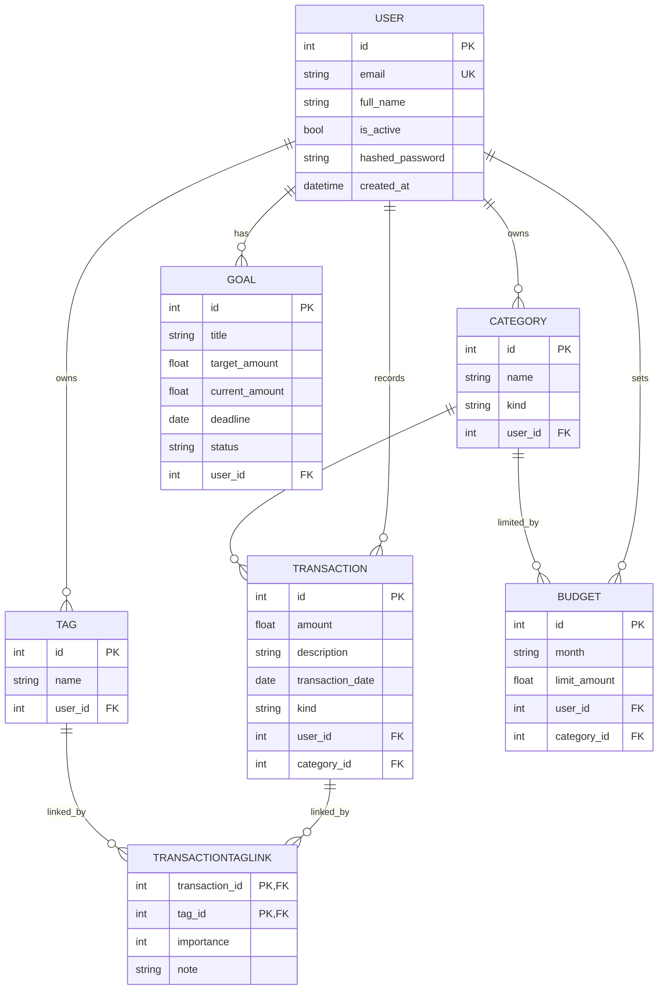

# База данных и модель данных

Источники истины по схеме:

- ORM-модели: `app/models/entities.py`
- миграция: `migrations/versions/0001_init_finance_schema.py`

Миграция создает 7 доменных таблиц + служебную `alembic_version`. Основные ограничения:

- уникальный email пользователя (`user.email`);
- уникальность категорий в пределах пользователя и типа (`uq_user_category`);
- уникальность тега в пределах пользователя (`uq_user_tag`);
- уникальность бюджета по `(user_id, category_id, month)` (`uq_budget_month`);
- композитный PK в join-таблице `transactiontaglink(transaction_id, tag_id)`.

Типы `kind` и `status` хранятся строками (`VARCHAR`), то есть PostgreSQL enum-типы не используются.

## Полная ER-диаграмма (Mermaid)

## Кардинальности и связи

- One-to-many:
  - `User -> Category`
  - `User -> Transaction`
  - `User -> Tag`
  - `User -> Budget`
  - `User -> Goal`
  - `Category -> Transaction`
  - `Category -> Budget`
- Many-to-many:
  - `Transaction <-> Tag` через `TransactionTagLink`
- Ассоциативная сущность с дополнительными полями:
  - `TransactionTagLink.importance` (1..10)
  - `TransactionTagLink.note`

## Где смотреть изменения схемы

- Новые поля/таблицы сначала описываются в `app/models/entities.py`.
- Затем создается новая Alembic-миграция в `migrations/versions/`.
- Применение: `alembic upgrade head`.

Разумное предположение: текущая миграция `0001` является baseline для среды разработки. Если схема меняется дальше, нужна новая ревизия, а не редактирование уже примененной миграции в shared-окружениях.
